<h2 style="text-shadow: 2px 2px rgb(255, 66, 201)"><ul class="photos">Mała Syrenka - nowa premiera</ul></h2>

Marzenia, Głębiny, Piękne Sny - Spełnienie na Scenie!

Marzenia to coś, co bije głęboko w naszych sercach, tak jak głębiny oceanu. Przyjdź i pozwól Małej Syrence spełnić swoje marzenie o zobaczeniu lądu, poznaniu ludzi i miłości do księcia. W jej podróży pomoże jej tajemnicza Meduza Ulla, a my będziemy obserwować, jak rozwija się ta niezwykła historia. Dołącz do nas, aby pomóc Syrence w jej podróży przez głębokie odmęty oceanu. Razem odkryjemy fascynującą kolekcję muszli, spotkamy kolorowe ryby, zaśpiewamy z Syrenką i zanurzymy się w magiczną krainę morskich przygód.

To spektakl dla widzów od 2,5 do 99 lat. Czas trwania wynosi około 55 minut. Premiera 6.11.2023.

Dołącz do nas na tej niezapomnianej podróży pod wodą i razem z Małą Syrenką odkryjmy świat marzeń!

<table border="0">
        <tr>
            <td>
                <strong>Grają</strong> 
                Gosia Gradkowska  
                Joanna Pietrońska  
                Ireneusz Wojaczek  
                Przemko Janiszko  
            </td>
            <td>
                <strong>Muzyka</strong> 
                Rafał Gajewski
            </td>
            <td>
                <strong>Inscenizacja</strong> 
                Małgorzata Domańska
            </td>
        </tr>
        <tr class="centered-row">
            <td colspan="4">
                <strong>Tekst</strong> 
                Pola Wójcik na podstawie J.Ch. Andersena
            </td>
        </tr>
</table>
 
<ul class="photos">    </ul>

 
 
 
 
 

<h2 style="text-shadow: 2px 2px rgb(255, 66, 201)"><ul class="photos">Tajemnice Teatru</ul></h2>
<a id="single_image" href="lay/img/p/tajemnice_teatru_big.png">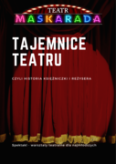</a>

Tajemnice Teatru czyli historia księżniczki i reżysera.  Spektakl - warsztaty teatralne. Czy wiecie jak powstaje spektakl?    
Zdradzimy Wam to w warsztatowym przedstawieniu Tajemnice Teatru. Pokażemy czym zajmuje się dramaturg, scenograf...   
Zobaczycie co wyniknie ze spotkania księżniczki i reżysera. Zaprosimy was do wspólnego tworzenia spektaklu a na koniec nauka charakteryzacji z Księżniczką.

Tajemnice Teatru to klasyczne przedstawienie teatralne, ale też rodzaj warsztatów dla dzieci.
Oglądamy historię księżniczki, która bardzo chce zagrać na scenie, ale najpierw musi zdobyć wiedzę, jak działa teatr.
Pomaga jej w tym Autor sztuki, który przeistacza się w kolejnych scenach w Reżysera, Scenografa, Kostiumologa, Charakteryzatora a na koniec Pana od niesamowitych efektów dźwiękowych.

W tej roli brawurowy Zbigniew Kozłowski, który świetnie nawiązuje kontakt z dziećmi, pokazuje im kulisy teatru, zaprasza je na scenę i poddaje różnym aktorskim próbom.
Grająca Księżniczkę Gosia Gradkowska pomaga mu w tym dziele, sama uczy się fachu, pięknie tańczy i śpiewa.
Dzieci wychodzą ze spektaklu z wiedzą "jak się robi teatr", dorosłych bawi dowcip i przymrużenie oka, z jakim opowiadamy o naszej pracy.

  Dla dzieci od 3 do 10 lat i całej rodziny.   Czas trwania spektaklu i animacji około 50 minut   Premiera 22.04.2023  

<!-- <iframe width="560" height="315" src="https://www.youtube.com/embed/02LBv_25oyM" frameborder="0" allow="accelerometer; autoplay; encrypted-media; gyroscope; picture-in-picture" allowfullscreen style="border-style:solid; border-width: 5px; border-radius: 10px; border-color:rgba(87, 171, 255, 0.74)"></iframe> -->

<table border="0"> <tr>
<td><strong>Grają</strong> Gosia Gradkowska  Zbigniew Kozłowski  Przemko Janiszko </td><td><strong>Muzyka</strong> Paweł Paluch</td><td><strong>Scenografia i inscenizacja</strong> Małgorzata Domańska</td> <td><strong>Reżyseria</strong> Zbigniew Kozłowski</td> </tr>
</table>

<ul class="photos">    </ul>

 
 
 
 
 

<h2 style="text-shadow: 2px 2px rgb(255, 66, 201)"><ul class="photos">Magiczne Drzewko Wróżek</ul></h2>
<a id="single_image" href="lay/img/drzewko_big.jpg">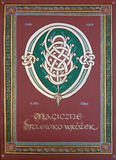</a>

Posłuchajcie - lecą wróżki, kto ich nie zna, poznać musi. Wróżki niosą pory roku, w magicznym drzewie domki swoje mają. Z Matką Naturą opiekują się zwierzątkami. I Ty spotkasz leśne zwierzątka, małe robaczki, ptaszki i jeże. Wróżka z Matką Naturą magią otulą świat cały a mali widzowie zanurzą się w teatralną magię wyczarowaną na scenie - światłem, dźwiękiem, muzyką i sami wezmą udział w teatralnej zabawie. Spektakl inspirowany Snem Nocy Letniej Williama Shakespeare'a i wierszami Leopolda Staffa.

  Dla dzieci od 1 do 6 lat i całej rodziny.   Czas trwania spektaklu i animacji około 55 minut   Premiera 7.11.2021  

<iframe width="560" height="315" src="https://www.youtube.com/embed/02LBv_25oyM" frameborder="0" allow="accelerometer; autoplay; encrypted-media; gyroscope; picture-in-picture" allowfullscreen style="border-style:solid; border-width: 5px; border-radius: 10px; border-color:rgba(87, 171, 255, 0.74)"></iframe>

<table border="0"> <tr> <td><strong>Grają</strong> Joanna Pietrońska,   Patrycja Potyralska,    Przemko Janiszko </td> <td><strong>Muzyka</strong> Krzysztof Gumienny</td> <td><strong>Opracowanie muzyczne</strong> Przemko Janiszko</td> <td><strong>Scenografia i inscenizacja</strong> Małgorzata Domańska</td> <td><strong>Tekst</strong> Pola Wójcik</td> <td><strong>Wiersze</strong> Leopolda Staffa i Williama Shakespeare'a ze Snu Nocy Letniej</td> </tr> </table>

<ul class="photos">    </ul>

 
 
 
 
 

<h2 style="text-shadow: 2px 2px rgb(255, 66, 201)"><ul class="photos">Królowa Myszy</ul></h2>
<a id="single_image" href="lay/img/krolowa_myszy_big.jpg">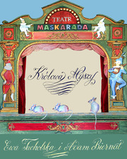</a>

Jeśli kochacie baśnie, to Królowa Myszy jest spektaklem dla Was. Klasyczna bajka o czarach, królewnie i czekoladzie. Opowiedziana przez aktorów i marionetki do muzyki “Dziadka do orzechów” Czajkowskiego. Magiczny świat zamknięty w małej teatralnej scenie wzorowanej na XVIII wiecznym włoskim teatrze marionetkowym, ożywiony błyskotliwą grą aktorów przeniesie nas na dwór królewski, gdzie harcują myszy.

  Dla dzieci od 2 do 8 lat i całej rodziny.   Czas trwania około 50 minut   Premiera 17.10.2021

<iframe width="560" height="315" src="https://www.youtube.com/embed/Q9LHmJW0_6g" frameborder="0" allow="accelerometer; autoplay; encrypted-media; gyroscope; picture-in-picture" allowfullscreen style="border-style:solid; border-width: 5px; border-radius: 10px; border-color:rgba(87, 171, 255, 0.74)"></iframe>

<table border="0">
<tr>
<td><strong>Grają</strong> Ewa Tucholska   Adam Biernat / Andrzej Krucz   Przemko Janiszko </td>
<td><strong>Muzyka</strong> Piotr Czajkowski Krzysztof Jaszczak</td>
<td><strong>Scenografia i inscenizacja</strong> Małgorzata Domańska</td>
<td><strong>Tekst</strong> Pola Wójcik</td>
</tr>
</table>
 

<ul class="photos">



</ul>

 
 
 
 
 

<h2 style="text-shadow: 2px 2px rgb(255, 66, 201)"><ul class="photos">Śnieżny show</ul></h2>

Śnieżny show to pierwszy śnieżny musical dla najmłodszych. Spektakl pełen tańca i śpiewu wciągający widzów w zimową magię. Będziemy pomagać muzycznym Śnieżynkom, brać udział w poszukiwaniu Zapomnianego Śnieżnego Skarbca i tworzyć własny Zimowy Musical. Otwórz się na zimową magię gdzie wszystko lśni, skrzy się i dźwięczy.

  Dla widzów od 1.5 roku do 99 lat.   Czas trwania około 55 minut   Premiera: grudzień 2020   

<ul class="photos">



</ul>

<table border="0">
<tr>
<td><strong>Muzyka</strong> Zuzanna Calka</td>
<td><strong>Występują</strong> Katarzyna Mazur / Gosia Gradkowska   Pamela Adamik / Karolina Gwóźdź </td>
<td><strong>Scenografia</strong> Małgorzata Domańska</td>
<td><strong>Tekst</strong> Pola Wójcik</td>
</tr>
</table>
 

 
 
 
 
 

<h2 style="text-shadow: 2px 2px rgb(255, 66, 201)"><ul class="photos">Złota Rybka</ul></h2>
<a id="single_image" href="lay/img/rybka_big.jpg">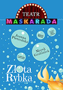</a>

Złota Rybka wg Aleksandra Puszkina to spektakl dla młodszych widzów o zgubnych skutkach nieprzemyślanych życzeń. Będziemy łowić rybki, wypowiadać życzenia, poznamy mądrą Złotą Rybkę, a wokół nas będzie szumiące morze i śpiewające ptaki.

  Dla dzieci od 1,5 do 8 lat.   Czas trwania około 45 minut   Premiera 28.10.2018.   

<iframe width="560" height="315" src="https://www.youtube.com/embed/I6uIPXobj9s" frameborder="0" allow="accelerometer; autoplay; encrypted-media; gyroscope; picture-in-picture" allowfullscreen style="border-style:solid; border-width: 5px; border-radius: 10px; border-color:rgba(87, 171, 255, 0.74)"></iframe>

<table border="0">
<tr>
<td><strong>Adaptacja i Muzyka</strong> Marek Grabiniok</td>
<td><strong>Występują</strong> Joanna Pietrońska   Marek Grabiniok</td>
<td><strong>Scenografia</strong> Małgorzata Domańska</td>
</tr>
</table>
 

<ul class="photos">



 



</ul>

 
 
 
 
 

<h2 style="text-shadow: 2px 2px rgb(255, 66, 201)"><ul class="photos">Brzydkie Kaczątko czyli tupu tup</ul></h2> <a id="single_image" href="lay/img/tup_big.jpg">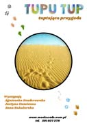</a>
<i>wg baśni H. Ch. Andersena</i>  

Kto najszybszy? Kto wygra wyścigi? Zając, gąsienica, jaskółka, czy brzydkie kaczątko? Będziemy biegać po piasku i po śladach. Dowiemy się czy wszyscy polubili kaczątko i co z niego wyrosło. Zapraszamy na sensoryczny spektakl na podstawie baśni H. Ch. Andersena _"Szybkobiegacze"_ i _"Brzydkie Kaczątko"_.

Dla dzieci od 1,5 do 6 lat.

Czas trwania około 45 minut

Premiera 5.11.2017

  

<iframe width="560" height="315" src="https://www.youtube.com/embed/d7V63BJ2-Wg" frameborder="0" allow="accelerometer; autoplay; encrypted-media; gyroscope; picture-in-picture" allowfullscreen style="border-style:solid; border-width: 5px; border-radius: 10px; border-color:rgba(87, 171, 255, 0.74)"></iframe>

  

<table border="0">
<tr>
<td><strong>Tekst</strong> Pola Wójcik</td>
<td><strong>Występują</strong> Agnieszka Senderowska   Justyna Gumienna Anna Bakalarska</td>
</tr>
<tr>
<td><strong>Muzyka</strong> Zuzanna Całka</td>
<td><strong>Inscenizacja</strong> Małgorzata Domańska</td>
</tr>
<tr>
<td><strong>Choreografia</strong> Agnieszka Senderowska</td>
</tr>

</table>
 

<ul class="photos">

<a id="single_image" rel="9" href="lay/img/tuptup/large/2.jpg">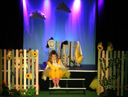</a>
<a id="single_image" rel="9" href="lay/img/tuptup/large/3.jpg">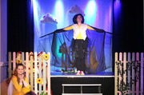</a>
 
<a id="single_image" rel="9" href="lay/img/tuptup/large/4.jpg">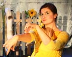</a>
<a id="single_image" rel="9" href="lay/img/tuptup/large/5.jpg">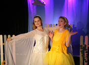</a>

</ul>

 
 
 
 
 

<h2 style="text-shadow: 2px 2px rgb(255, 66, 201)"><ul class="photos">Wesołe Koty</ul></h2>

<i>wg Marii Konopnickiej</i>  
Poznajmy roztańczone, rozśpiewane i psotne koty z wierszy Marii Konopnickiej. Filuś, Miluś i Kizia zaproszą młodych widzów do zabawy i na koci bal. Piękne wiersze M. Konopnickiej, barokowe kocie kostiumy, muzyka H. Wieniawskiego i piosenki Zuzanny Całki tworzą magiczny i interaktywny koci świat dla młodych widzów.

 
<iframe width="560" height="315" src="https://www.youtube.com/embed/FjIP1sC9Yxw" frameborder="0" allow="autoplay; encrypted-media" allowfullscreen style="border-style:solid; border-width: 5px; border-radius: 10px; border-color:rgba(87, 171, 255, 0.74)"></iframe>
 

    Czas trwania około 45 minut.  Przedstawienie dla dzieci od 4 lat do 8 lat

 Premiera: 25 wrzesień 2016   

<table border="0">
<tr>
<td><strong>Teksty piosenek</strong> Pola Wójcik   Jan Falba </td>
<td><strong>Występują</strong> Pamela Adamik/Joanna Pietrońska   Marek Grabiniok/Przemko Janiszko</td>
</tr>
<tr>
<td><strong>Muzyka</strong> Zuzanna Całka</td>
<td><strong>Scenografia</strong> Małgorzata Domańska</td>
</tr>
<tr>
<td><strong>Charakteryzacja</strong> MAKE UP STAR</td>
</tr>
</table>

  

<ul class="photos">
<a id="single_image" rel="8" href="lay/img/koty/large/12.jpg">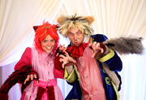</a>

 
<a id="single_image" rel="8" href="lay/img/koty/large/5.jpg">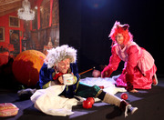</a>
<a id="single_image" rel="8" href="lay/img/koty/large/6.jpg">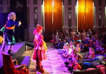</a>
<a id="single_image" rel="8" href="lay/img/koty/large/3.jpg">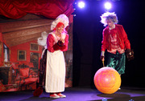</a>
 
<a id="single_image" rel="8" href="lay/img/koty/large/1.jpg">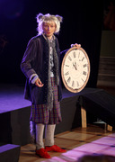</a>
<a id="single_image" rel="8" href="lay/img/koty/large/10.jpg">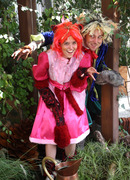</a>
<a id="single_image" rel="8" href="lay/img/koty/large/11.jpg">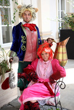</a>
 
<a id="single_image" rel="8" href="lay/img/koty/large/7.jpg">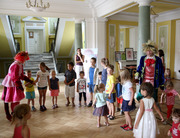</a>
<a id="single_image" rel="8" href="lay/img/koty/large/2.jpg">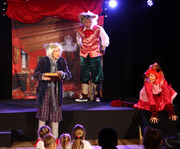</a>  

<a id="single_image" rel="8" href="lay/img/koty/large/14.jpg">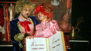</a>

</ul>

 
 
 
 
 

<h2 style="text-shadow: 2px 2px rgb(255, 66, 201)"><ul class="photos">Urodziny Turli i Taja</ul></h2>

<a id="single_image" href="lay/img/turlitaj/large/turlitaj.jpg">
<!-- </a> -->

W krainie Turli Taja dzisiaj wielki dzień - Pierwsze Urodziny!  Poznamy Turli i Taja, dowiemy się co lubią robić najbardziej, będziemy się z nimi turlać, bawić i krążyć w labiryncie. Powitamy ich gości i przygotujemy wspólnie przyjęcie urodzinowe z wielkim tortem. Swiętujcie z nami urodziny Turli-Taja!  Przedstawienie dla dzieci od 0 do 5 lat. Czas trwania około 45 minut.  Premiera: maj 2016   

<iframe width="560" height="315" src="https://www.youtube.com/embed/XyaKJ2pxhyA" frameborder="0" allow="autoplay; encrypted-media" allowfullscreen style="border-style:solid; border-width: 5px; border-radius: 10px; border-color:rgba(87, 171, 255, 0.74)"></iframe>
  

Fragment <a href="http://czasdzieci.pl/okiem-rodzica/id,7320ebe.html">recenzji portalu Czas Dzieci:</a>   <i>Co wyróżnia spektakl? Brak sceny, czyli znika bariera między twórca a odbiorcą. Dzieci mogły wszędzie wejść, zajrzeć, wszystko dotykać, przekładać itp. A taka eksploracja otoczenia, szczególnie nowego, ciekawego, to dla maluszków niesamowity rozwój i przed wszystkim frajda. Dotychczas prawie wszystkie spektakle dla najmłodszych dzieci, na których byłam, odbywały się w ciszy. To znaczy, aktorzy, prawie wcale albo bardzo rzadko, odzywali się do publiczności. A tu od początku, dwie młode, bardzo utalentowane aktorki, mówią i śpiewają do dzieci. Zadają pytania, przynoszą rekwizyty do każdego dziecka, reagują na spontaniczne na ich prośby. Są prawdziwymi gospodarzami swojego przyjęcia urodzinowego!</i>  

<table border="0">
<tr>
<td><strong>Tekst</strong> Pola Wójcik </td>
<td><strong>Scenografia</strong> Małgorzata Domańska  </td>
<td><strong>Muzyka</strong> Zuzanna Całka  </td>
</tr>
</table>
 
<strong>Występują</strong>
  
Katarzyna Mazur 
Joanna Pietrońska 
Przemko Janiszko 

  

<ul class="photos">



</ul>

 
 
 
 
 

<h2 style="text-shadow: 2px 2px rgba(255, 42, 206, 0.58)"><ul class="photos">Kuba i Buba, czyli awantura do kwadratu</ul></h2>
 <strong>Na podstawie książek Grzegorza Kasdepke</strong>  
<!---->

Przedstawienie "Kuba i Buba, czyli awantura do kwadratu" powstało na podstawie cieszących się wielką popularnością książek Grzegorza Kasdepke. Kuba i Buba są niesfornymi bliźniakami, nie zawsze wiadomo, które jest które. W domu  trudno je opanować, a w szkole dokazują jeszcze bardziej.  Przedstawienie dla dzieci od 5 do 12 lat trwa 55 minut.   Premiera: 7 grudzień 2014
  
<td><strong>Reżyseria</strong> Ewa Tucholska  </td>
<table border="0">
<tr>
<td><strong>Tekst</strong> Pola Wójcik </td>
<td><strong>Teksty piosenek</strong> Jan Falba  </td>

</tr>
<tr>
<td><strong>Scenografia</strong> Małgorzata Domańska </td>
<td><strong>Muzyka</strong> Krzysztof Jaszczak  </td>
</tr>
</table>
 
<strong>Występują</strong>  Buba - Ewa Tucholska  Kuba - Adam Biernat  Tata/Nauczyciel - Michał Maliszewski  Woźny - Przemko Janiszko  

<ul class="photos">

  

</ul>
 
 
 

 

<h2 style="text-shadow: 2px 2px rgba(3, 206, 255, 0.85)"><ul class="photos">Chmurka i Bratek</ul></h2>
 

Czy wiecie co robi Chmurka na ziemi? Spotyka Bratka i pomaga roślince rozkwitnąć.
A także objaśni nam różne zjawiska pogodowe i pokaże jak ważne jest czyste środowisko.
Rezolutna Chmurka i bohaterski Bratek zapraszają na interaktywny muzyczny spektakl w
chmurach. Przekonacie się, że przyjaźń może przezwyciężyć wszelkie kłopoty.

Spektakl dla dzieci od 1.5 roku do 6 lat. Czas trwania około 45 minut.
  Premiera 26 październik 2014    <table border="0"> <tr> <td><strong>Tekst</strong> Pola Wójcik </td> <td><strong>Występują</strong> Karolina Węgrzyńska Michał Węgrzyński  </td> </tr> <tr> <td><strong>Konsultacja reżyserska</strong> Katarzyna Kawalec </td> <td><strong>Multimedia</strong> Jan Falba  </td> </tr> <tr> <td><strong>Muzyka</strong> Zuzanna Całka</td> <td><strong>Scenografia</strong> Małgorzata Domańska</td> </tr> </table>

<ul class="photos">    </ul>

 
 
 
 

<h2 style="text-shadow: 2px 2px rgb(208, 176, 33)"><ul class="photos">Jaś, Małgosia i piernikowa kraina</ul></h2>
 

Zapraszamy dzieci na warsztaty teatralno plastyczne. Wysłuchamy inscenizowanej bajki "Jaś i Małgosia" w scenerii starej piekarni. Zbudujemy domki z "piernika", wykonamy maski i kostiumy. Mali widzowie zamienią się w motylki, żabki, koniki i ptaszki. Pomogą Małgosi i Jasiowi w ich wędrówce przez las i wezmą udział w etiudach scenicznych. A gdy znajdą się już w piernikowej krainie, ozdobią serca dla mam.
 Warsztaty pomogą zrozumieć dzieciom jak ważny jest dźwięk, kostium i dekoracja w teatrze. Dzieci same zbudują dekorację, będą mogły wcielić się w role zwierzątek i wziąć udział w krótkich etiudach. Rodziców zapraszamy do pomocy w tworzeniu dekoracji i kostiumów.  
Warsztaty dla dzieci w wieku od 2 lat  
Czas trwania około półtorej godziny  
Cena biletu dla dziecka 39zł, dorosły 25zł  
  
<table border="0">
<tr>
<td><strong>Prowadzą</strong> Monika Głowienko Jan Falba  </td>
</tr>
</table>
 
<ul class="photos">

 

 
</ul>
  

<h2 style="text-shadow: 2px 2px rgba(149, 211, 9, 0.79)"><ul class="photos">Calineczka</ul></h2>
 

Zapraszamy małych widzów do magicznego świata pełnego barw, światła i muzyki. Razem z Calineczką poznacie Ropuchę, Motyla, Myszkę, Kreta i Jaskółkę. Impresja teatralna na podstawie bajki Andersena wciąga widzów do zabawy, gdzie zaciera się granica między światem realnym, a fantastycznym.

Przedstawienie dla dzieci w wieku od 1,5 do 10 lat  
Przedstawienie trwa około 45 minut.   
Premiera: 30 marzec 2014  
  
<iframe width="560" height="315" src="https://www.youtube.com/embed/aq-JZwyPaGQ" frameborder="0" allow="autoplay; encrypted-media" allowfullscreen style="border-style:solid; border-width: 5px; border-radius: 10px; border-color:rgba(87, 171, 255, 0.74)"></iframe>
  
<table border="0">
<tr>
<td><strong>Występują</strong> Katarzyna Mazur i Joanna Pietrońska Adam Biernat / Andrzej Krucz  </td>
<td><strong>Muzyka</strong> Zuzanna Całka</td>
</tr>
<tr>
<td><strong>Choreografia</strong> Agnieszka Senderowska</td>
<td><strong>Scenografia</strong> Małgorzata Domańska</td>
</tr>
</table>

<strong>Tekst</strong> Jan Falba

  

<ul class="photos">

 

 

 
</ul>

      

<h2 style="text-shadow: 2px 2px rgba(255, 68, 68, 0.72)">Elfy i fabryka prezentów</h2>
 
<a id="single_image" href="lay/img/elfy_big.jpg">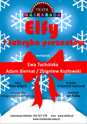</a>

W fabryce prezentów na biegunie praca wre. Zbliża się północ, Mikołaj odpoczywa przed podróżą, a dwa Elfy spieszą się, by przygotować wszystkie prezenty. Oczywiśćie nie obędzie się bez komplikacji.
 
Czy zdążą na czas?
 
Elfy poproszą dzieci o pomoc w pakowaniu i w zimowych zabawach.
  
Przedstawienie trwa około 55 minut.
 
Przedstawienie dla dzieci w wieku od 2,5 do 99 lat
  
Premiera: 7 grudzień 2013

  

<iframe width="560" height="315" src="https://www.youtube.com/embed/ovOwUmozCns" frameborder="0" allow="accelerometer; autoplay; encrypted-media; gyroscope; picture-in-picture" style="border-style:solid; border-width: 5px; border-radius: 10px; border-color:rgba(87, 171, 255, 0.74)" allowfullscreen></iframe>

  

<table border="0">
<tr>
<td><strong>Tekst</strong> Pola Wójcik</td>
<td><strong>Reżyseria</strong> Ewa Tucholska i Tomasz Piątkowski</td>
</tr>
<tr>
<td><strong>Elfy</strong> Ewa Tucholska Adam Biernat Zbigniew Kozłowski Joanna Pietrońska Przemko Janiszko </td>
<td><strong>Scenografia</strong> Małgorzata Domańska</td>
</tr>
<tr>
<td><strong>Muzyka</strong> Krzysztof Jaszczak</td>
<td><strong>Piosenki</strong> Jan Falba</td>
</tr>
</table>
  
<ul class="photos">

 

 

 

 

 

 
</ul>

    

<h2 style="text-shadow: 2px 2px #ffe100">Księżniczka na ziarnku grochu</h2>    
 Czy pamiętacie bajkę o księżniczce, której prawdziwość zostaje poddana próbie za pomocą podłożonego - pod sterty miękkich poduszek i kołder - ziarnka grochu? Opowiedział  ją pierwszy Christian Andersen. Występują w niej Król i Królowa. Jest w niej też Młody Książę, który szuka prawdziwej Księżniczki i… miłości też najprawdziwszej. W spektaklu zobaczymy wszystkie postacie o których mowa, w pięknych kostiumach przypominających dwór francuski. Będziemy odtwarzać historię konkursu piękności, w którym wygra Pirlipatka i będzie tańczyć wyrafinowanego menueta, a nawet rapować… Zapraszamy wszystkie dzieci, które lubią bajki  opowiedziane pięknymi obrazami i chcą poznać  historię Pirlipatki i Księcia.    Przedstawienie trwa około 50 minut bez przerwy.   Przedstawienie rekomendowane dla dzieci w wieku od 4 do 12 lat
  
Premiera: 13 październik 2013
  

<iframe width="560" height="315" src="https://www.youtube.com/embed/fBmbJFhO638" frameborder="0" allow="accelerometer; autoplay; encrypted-media; gyroscope; picture-in-picture" allowfullscreen style="height:220px margin: 10px; border-style:solid; border-width: 5px; border-radius: 10px; border-color:rgba(87, 171, 255, 0.74)"></iframe>
  

<table border="0">
<tr>
<td><h3>Występują  </h3></td>
<td><strong>Reżyseria</strong> Renata Dymna</td>
</tr>

<tr>
<td><strong>Królowa, Księżniczka Pirlipatka</strong> Patrycja Potyralska Ewa Tucholska  </td>
<td><strong>Scenografia</strong> Małgorzata Domańska</td>
</tr>

<tr>
<td><strong>Król, Młody Książę</strong> Zbigniew Kozłowski/ Hubert Mrozowicz  </td>
<td><strong>Choreografia</strong>  Agnieszka Senderowska</td>
</tr>

<tr>
<td><strong>Narrator</strong> Andrzej Malec Przemko Janiszko</td>
<td><strong>Opracowanie filmowe i muzyczne</strong> Jan Falba</td>
</tr>
</table>
  

<strong>Muzyka Wolfganga Amadeusza Mozarta w wykonaniu:</strong>     

<table border="0">

<tr>
<td>Zuzanny Całki</td>
<td>Małgorzaty Wasiucionek</td>
</tr>

<tr>
<td>fortepian</td>
<td>skrzypce</td>
</tr>
</table>
  
<strong>W nagraniu filmowym wystąpiły</strong>
  
<table border="0">
<tr>
<td>Księżniczka Srebrna Chmurka </td>
<td>Emilia Kijowska</td>
</tr>
<tr>
<td>Księżniczka Marcepanu </td>
<td>Marta Zdanowska</td>
</tr>
<tr>
<td>Księżniczka Pięciu Sosen </td>
<td>Marta Dziuba</td>
</tr>
<tr>
<td>Księżniczka Wędrowniczka </td>
<td>Wanda Onyszkiewicz-Gnap</td>
</tr>
<tr>
<td>Księżniczka Hulajnóżka </td>
<td>Klaudia Grzywacz</td>
</tr>
</table>

<ul class="photos">

 

</ul>

      

<h2 style="text-shadow: 3px 3px  #47ff2d">Co w trawie bzyczy?</h2>
 

Zapraszamy maluchy na kameralny spektakl, w którym spotkają pszczółki, ślimaczki, motylki i pajączki. Przedstawienie jest interaktywne. Aktorzy wciągają dzieci do teatralnej zabawy.
  
<table border="0">
<tr>
<td><strong>Występują</strong></td>

<td><strong>Realizacja  </strong></td>
</tr>

<tr> <td>Ewa Tucholska Zbigniew Kozłowski</td> <td>Małgorzata Domańska Ewa Tucholska Tomasz Piątkowski</td> </tr> </table>  <strong>Muzyka</strong> Krzysztof Jaszczak    Przedstawienie trwa około 30 minut oraz 15 minut zabawy z aktorami.   Przedstawienie rekomendowane dla dzieci w wieku od 1,5 roku do 5 lat.   Premiera: 12 październik 2013  

  

<ul class="photos">

 

 

</ul>

