<h2 style="text-shadow: 2px 2px rgb(255, 66, 201)"><ul class="photos">Urodziny Turli i Taja</ul></h2>
 <strong>Na podstawie książek Grzegorza Kasdepke</strong>  
<!---->

W krainie Turli Taja dzisiaj wielki dzień - Pierwsze Urodziny!  Poznamy Turli i Taja, dowiemy się co lubią robić najbardziej, będziemy się z nimi turlać, bawić i krążyć w labiryncie. Powitamy ich gości i przygotujemy wspólnie przyjęcie urodzinowe z wielkim tortem. Swiętujcie z nami urodziny Turli-Taja!  Przedstawienie dla dzieci od 0 do 5 lat. Czas trwania 30 minut + 15 świętowania z aktorami.  Premiera: maj 2016
  
<table border="0">
<tr>
    <td><strong>Tekst</strong> Pola Wójcik </td>
    <td><strong>Muzyka</strong> Zuzanna Całka  </td>
    
</tr>
<tr>
    <td><strong>Scenografia</strong> Małgorzata Domańska </td>
    <td><strong>Muzyka</strong> Krzysztof Jaszczak  </td>
</tr>
</table>
 
<strong>Występują</strong>
  
Anna Bakalarska 
Monika Głowienko 
Agnieszka Senderowska
 Jan Falba 

 
 
 
 

<h2 style="text-shadow: 2px 2px rgba(255, 42, 206, 0.58)"><ul class="photos">Kuba i Buba, czyli awantura do kwadratu</ul></h2>
 <strong>Na podstawie książek Grzegorza Kasdepke</strong>  
<!---->

Przedstawienie "Kuba i Buba, czyli awantura do kwadratu" powstało na podstawie cieszących się wielką popularnością książek Grzegorza Kasdepke. Kuba i Buba są niesfornymi bliźniakami, nie zawsze wiadomo, które jest które. W domu  trudno je opanować, a w szkole dokazują jeszcze bardziej.  Przedstawienie dla dzieci od 4 do 12 lat trwa 55 minut.   Premiera: 7 grudzień 2014
  
<td><strong>Reżyseria</strong> Ewa Tucholska  </td>
<table border="0">
<tr>
    <td><strong>Tekst</strong> Pola Wójcik </td>
    <td><strong>Teksty piosenek</strong> Jan Falba  </td>
    
</tr>
<tr>
    <td><strong>Scenografia</strong> Małgorzata Domańska </td>
    <td><strong>Muzyka</strong> Krzysztof Jaszczak  </td>
</tr>
</table>
 
<strong>Występują</strong>  Buba - Ewa Tucholska  Kuba - Adam Biernat  Tata/Nauczyciel - Michał Maliszewski  Woźny - Jan Falba   

<ul class="photos">
    <a id="single_image" rel="6" href="lay/img/kuba_i_buba/large/1.jpg">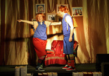</a>
    <a id="single_image" rel="6" href="lay/img/kuba_i_buba/large/2.jpg">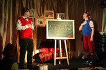</a>
    <a id="single_image" rel="6" href="lay/img/kuba_i_buba/large/3.jpg">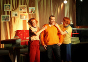</a>  
    <a id="single_image" rel="6" href="lay/img/kuba_i_buba/large/4.jpg">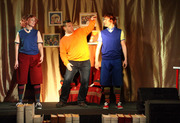</a>
    <a id="single_image" rel="6" href="lay/img/kuba_i_buba/large/5.jpg">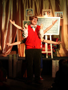</a>
    <a id="single_image" rel="6" href="lay/img/kuba_i_buba/large/6.jpg">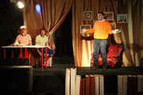</a>
</ul>
 
 
 

 

<h2 style="text-shadow: 2px 2px rgba(3, 206, 255, 0.85)"><ul class="photos">Chmurka i Bratek</ul></h2>
 
<a id="single_image" href="lay/img/chmurka_big.jpg">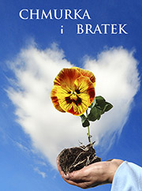</a>

Czy wiecie co robi Chmurka na ziemi? Spotyka Bratka i pomaga roślince rozkwitnąć.
A także objaśni nam różne zjawiska pogodowe i pokaże jak ważne jest czyste środowisko.
Rezolutna Chmurka i bohaterski Bratek zapraszają na interaktywny muzyczny spektakl w
chmurach. Przekonacie się, że przyjaźń może przezwyciężyć wszelkie kłopoty.
Spektakl dla dzieci od 1.5 roku do 6 lat. Czas trwania spektaklu - 45 minut.

 Premiera 26 październik 2014
  
<table border="0">
<tr>
    <td><strong>Tekst</strong> Pola Wójcik </td>
    <td><strong>Występują</strong> Justyna Gumienna / Magdalena Pawelec Michał Węgrzyński / Jerzy Dowgiałło  </td>
</tr>
<tr>
    <td><strong>Konsultacja reżyserska</strong> Katarzyna Kawalec </td>
    <td><strong>Multimedia</strong> Jan Falba  </td>
</tr>
<tr>
    <td><strong>Muzyka</strong> Zuzanna Całka</td>
    <td><strong>Scenografia</strong> Małgorzata Domańska</td>
</tr>
</table>
 
<ul class="photos">
    
    
    <a id="single_image" rel="5" href="lay/img/bratek/large/3.jpg">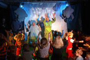</a>
    <a id="single_image" rel="5" href="lay/img/bratek/large/4.jpg">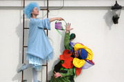</a>
    <a id="single_image" rel="5" href="lay/img/bratek/large/5.jpg">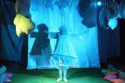</a>
    
    <a id="single_image" rel="5" href="lay/img/bratek/large/7.jpg">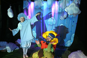</a>
    
    <a id="single_image" rel="5" href="lay/img/bratek/large/12.jpg">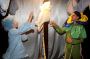</a>
    
</ul>
 
 
 
 

<h2 style="text-shadow: 2px 2px rgb(208, 176, 33)"><ul class="photos">Jaś, Małgosia i piernikowa kraina</ul></h2>
 
<a id="single_image" href="lay/img/piernik_big.jpg">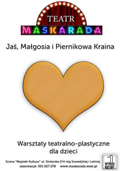</a>

    Zapraszamy dzieci na warsztaty teatralno plastyczne. Wysłuchamy inscenizowanej bajki "Jaś i Małgosia" w scenerii starej piekarni. Zbudujemy domki z "piernika", wykonamy maski i kostiumy. Mali widzowie zamienią się w motylki, żabki, koniki i ptaszki. Pomogą Małgosi i Jasiowi w ich wędrówce przez las i wezmą udział w etiudach scenicznych. A gdy znajdą się już w piernikowej krainie, ozdobią serca dla mam.
 Warsztaty pomogą zrozumieć dzieciom jak ważny jest dźwięk, kostium i dekoracja w teatrze. Dzieci same zbudują dekorację, będą mogły wcielić się w role zwierzątek i wziąć udział w krótkich etiudach. Rodziców zapraszamy do pomocy w tworzeniu dekoracji i kostiumów.  
Warsztaty dla dzieci w wieku od 2 lat  
Czas trwania - ok. półtorej godziny  
Cena biletu dla dziecka 30zł, dorosły 20zł  
  
<table border="0">
<tr>
	<td><strong>Prowadzą</strong> Monika Głowienko Jan Falba  </td>
</tr>
</table>
 
<ul class="photos">
    
    <a id="single_image" rel="4" href="lay/img/jas_malg/large/3.jpg">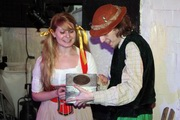</a>
    <a id="single_image" rel="4" href="lay/img/jas_malg/large/4.jpg">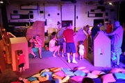</a>
     
    <a id="single_image" rel="4" href="lay/img/jas_malg/large/5.jpg">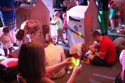</a>
    <a id="single_image" rel="4" href="lay/img/jas_malg/large/6.jpg">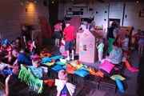</a>
    <a id="single_image" rel="4" href="lay/img/jas_malg/large/7.jpg">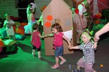</a>
 
</ul>
  

<h2 style="text-shadow: 2px 2px rgba(149, 211, 9, 0.79)"><ul class="photos">Calineczka</ul></h2>
 
<a id="single_image" href="lay/img/cal_big.jpg">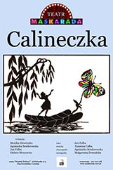</a>

    Zapraszamy małych widzów do magicznego świata pełnego barw, światła i muzyki. Razem z Calineczką poznacie Ropuchę, Motyla, Myszkę, Kreta i Jaskółkę. Impresja teatralna na podstawie bajki Andersena wciąga widzów do zabawy, gdzie zaciera się granica między światem realnym, a fantastycznym.

Przedstawienie dla dzieci w wieku od 1,5 do 10 lat  
Przedstawienie trwa 40 minut.   
Premiera: 30 marzec 2014  
  
<table border="0">
<tr>
	<td><strong>Występują</strong> Agnieszka Senderowska Monika Głowienko / Anna Bakalarska Jan Falba  </td>
    <td><strong>Muzyka</strong> Zuzanna Całka</td>
</tr>
<tr>
	<td><strong>Choreografia</strong> Agnieszka Senderowska</td>
	<td><strong>Scenografia</strong> Małgorzata Domańska</td>
</tr>
</table>

<strong>Tekst</strong> Jan Falba

  
<ul class="photos">
<a id="single_image" rel="4" href="lay/img/cal/large/1.JPG">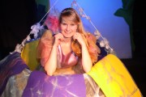</a>
<a id="single_image" rel="4" href="lay/img/cal/large/2.JPG">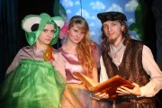</a>
<a id="single_image" rel="4" href="lay/img/cal/large/3.JPG">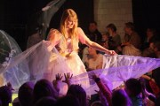</a>
 
<a id="single_image" rel="4" href="lay/img/cal/large/4.JPG">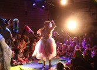</a>
<a id="single_image" rel="4" href="lay/img/cal/large/5.JPG">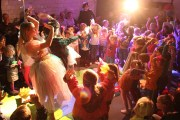</a>
<a id="single_image" rel="4" href="lay/img/cal/large/6.JPG">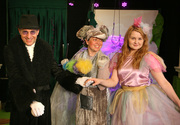</a>
 
<a id="single_image" rel="4" href="lay/img/cal/large/7.JPG">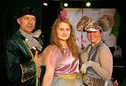</a>
<a id="single_image" rel="4" href="lay/img/cal/large/8.JPG">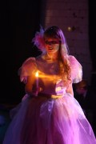</a>

<a id="single_image" rel="4" href="lay/img/cal/large/10.JPG">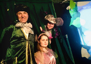</a>
 
</ul>

  
 
 

<h2 style="text-shadow: 2px 2px rgba(255, 68, 68, 0.72)">Elfy i fabryka prezentów</h2>
 
<a id="single_image" href="lay/img/elfy_big.jpg">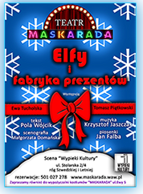</a>

W fabryce prezentów na biegunie praca wre. Zbliża się północ, Mikołaj odpoczywa przed podróżą, a dwa Elfy spieszą się, by przygotować wszystkie prezenty. Oczywiśćie nie obędzie się bez komplikacji.
 
Czy zdążą na czas?
 
Elfy poproszą dzieci o pomoc w pakowaniu i w zimowych zabawach.
  
Przedstawienie trwa 30 minut + 30 minut zabawy z Elfami.
 
Przedstawienie dla dzieci w wieku od 2 do 99 lat
  
Premiera: 7 grudzień 2013
    
<table border="0">
<tr>
    <td><strong>Tekst</strong> Pola Wójcik</td>
	<td><strong>Reżyseria</strong> Ewa Tucholska i Tomasz Piątkowski</td>
</tr>
<tr>
	<td><strong>Elfy</strong> Ewa Tucholska Adam Biernat/ Zbigniew Kozłowski/ Tomasz Piątkowski  </td>
	<td><strong>Scenografia</strong> Małgorzata Domańska</td>
</tr>
<tr>
	<td><strong>Muzyka</strong> Krzysztof Jaszczak</td>
	<td><strong>Piosenki</strong> Jan Falba</td>
</tr>
</table>
  
<ul class="photos">

<a id="single_image" rel="3" href="lay/img/elfy/large/04.jpg">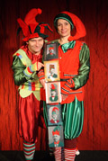</a>
<a id="single_image" rel="3" href="lay/img/elfy/large/02.jpg">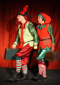</a>
 
<a id="single_image" rel="3" href="lay/img/elfy/large/18.jpg">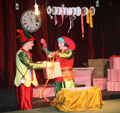</a>
<a id="single_image" rel="3" href="lay/img/elfy/large/19.jpg">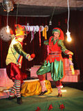</a>
<a id="single_image" rel="3" href="lay/img/elfy/large/20.jpg">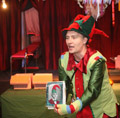</a>
 

<a id="single_image" rel="3" href="lay/img/elfy/large/05.jpg">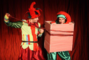</a>
<a id="single_image" rel="3" href="lay/img/elfy/large/06.jpg">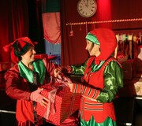</a>
 
<a id="single_image" rel="3" href="lay/img/elfy/large/07.jpg">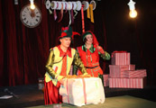</a>
<a id="single_image" rel="3" href="lay/img/elfy/large/08.jpg">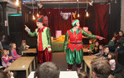</a>
<a id="single_image" rel="3" href="lay/img/elfy/large/09.jpg">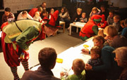</a>
 
<a id="single_image" rel="3" href="lay/img/elfy/large/10.jpg">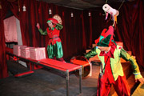</a>
<a id="single_image" rel="3" href="lay/img/elfy/large/11.jpg">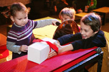</a>
<a id="single_image" rel="3" href="lay/img/elfy/large/12.jpg">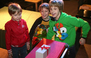</a>
 
<a id="single_image" rel="3" href="lay/img/elfy/large/13.jpg">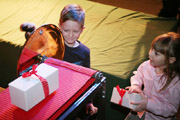</a>
<a id="single_image" rel="3" href="lay/img/elfy/large/14.jpg">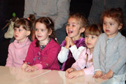</a>
<a id="single_image" rel="3" href="lay/img/elfy/large/15.jpg">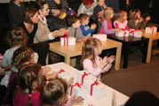</a>
<a id="single_image" rel="3" href="lay/img/elfy/large/16.jpg">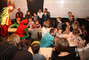</a>
<a id="single_image" rel="3" href="lay/img/elfy/large/17.jpg">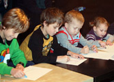</a>
 
</ul>

    
<h2 style="text-shadow: 2px 2px #ffe100">Księżniczka na ziarnku grochu</h2>
 
<a id="single_image" href="lay/img/plakat_big.jpg">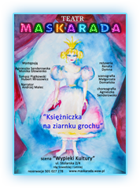</a>

Czy pamiętacie bajkę o księżniczce, której prawdziwość zostaje poddana próbie za pomocą podłożonego - pod sterty miękkich poduszek i kołder - ziarnka grochu?
Opowiedział  ją pierwszy Christian Andersen. Występują w niej Król i Królowa. Jest w niej też Młody Książę, który szuka prawdziwej Księżniczki i… miłości też najprawdziwszej.
	W spektaklu zobaczymy wszystkie postacie o których mowa, w pięknych kostiumach przypominających dwór francuski. Będziemy odtwarzać historię konkursu piękności, w którym wygra Pirlipatka i będzie tańczyć wyrafinowanego menueta, a nawet rapować…
 	Zapraszamy wszystkie dzieci, które lubią bajki  opowiedziane pięknymi obrazami i chcą poznać  historię Pirlipatki i Księcia.
  
Przedstawienie trwa 50 minut bez przerwy.
 
Przedstawienie dla dzieci w wieku od 4 do 11 lat
  
Premiera: 13 październik 2013
  
<table border="0">
<tr>
	<td><h3>Występują  </h3></td>
	<td><strong>Reżyseria</strong> Renata Dymna</td>
</tr>

<tr>
	<td><strong>Królowa, Księżniczka Pirlipatka</strong> Agnieszka Senderowska/  Monika Głowienko  </td>
	<td><strong>Scenografia</strong> Małgorzata Domańska</td>
</tr>

<tr>
	<td><strong>Król, Młody Książę</strong> Zbigniew Kozłowski/ Hubert Mrozowicz  </td>
	<td><strong>Choreografia</strong> Agnieszka Senderowska</td>
</tr>

<tr>
	<td><strong>Narrator</strong> Andrzej Malec</td>
	<td><strong>Opracowanie filmowe i muzyczne</strong> Jan Falba</td>

</table>
  
<strong>Muzyka Wolfganga Amadeusza Mozarta w wykonaniu:</strong>
  
<table border="0">
<tr>
	<td>Zuzanny Całki</td>
	<td>Małgorzaty Wasiucionek</td>
</tr>

<tr>
	<td>fortepian</td>
	<td>skrzypce</td>
</tr>
</table>
  
<strong>W nagraniu filmowym wystąpiły</strong>
  
<table border="0">
<tr>
<td>Księżniczka Srebrna Chmurka </td>
<td>Emilia Kijowska</td>
</tr>
<tr>
<td>Księżniczka Marcepanu </td>
<td>Marta Zdanowska</td>
</tr>
<tr>
<td>Księżniczka Pięciu Sosen </td>
<td>Marta Dziuba</td>
</tr>
<tr>
<td>Księżniczka Wędrowniczka </td>
<td>Wanda Onyszkiewicz-Gnap</td>
</tr>
<tr>
<td>Księżniczka Hulajnóżka </td>
<td>Klaudia Grzywacz</td>
</tr>
</table>

<ul class="photos">
<a id="single_image" rel="1" href="lay/img/ks/large/1.jpg">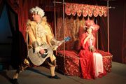</a>
<a id="single_image" rel="1" href="lay/img/ks/large/2.jpg">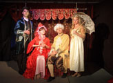</a>

 

</ul>

      
<h2 style="text-shadow: 3px 3px  #47ff2d">Co w trawie bzyczy?</h2>
 

Zapraszamy maluchy na kameralny spektakl, w którym spotkają pszczółki, ślimaczki, motylki i pajączki. Przedstawienie jest interaktywne. Aktorzy wciągają dzieci do teatralnej zabawy.
  
<table border="0">
<tr>
	<td><strong>Występują</strong></td>
	
	<td><strong>Realizacja  </strong></td>
</tr>

<tr>
	<td>Ewa Tucholska Zbigniew Kozłowski</td>
	<td>Małgorzata Domańska Ewa Tucholska Tomasz Piątkowski</td>
</tr>
</table>
 <strong>Muzyka</strong> Krzysztof Jaszczak   
Przedstawienie trwa 30 minut oraz 15 minut zabawy z aktorami.  
Przedstawienie dla dzieci w wieku od 1,5 roku do 5 lat.  
Premiera: 12 październik 2013  

  

<ul class="photos">

 

 

</ul>

