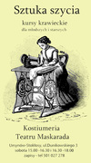

## Warsztaty

<h2><ul class="photos">Warsztaty teatralno-taneczne</ul></h2>

Zajęcia teatralne prowadzone wg autorskiego programu Teatru Maskarada wprowadzają dzieci do magicznego świata teatru. Uczestnicy będą rozwijali swoją wyobraźnię i umiejętności poprzez działania twórcze z zakresu pantomimy, teatru słowa, cieni i lalek. Podróż poprzez emocje będzie niezapomnianym doświadczeniem i jednocześnie wspaniałą zabawą. Wspólnie będziemy tworzyć spektakl.
 
 Zajęcia w niedziele lub czwartki o godzinie 17:00.
 Koszt zajęć pojedynczych: 35zł
  Zapisy: 501 - 027 - 278.
 Miejsce: Teatr Maskarada - Nowy Świat

<!--
<h2><ul class="photos">Sztuka szycia</ul></h2>

Cykl warsztatów dla dorosłych i dzieci od ośmiu lat. Indywidualnym podejściem do każdego kursanta uczymy praktycznego szycia. W miłej atmosferze i w otoczeniu kostiumów teatralnych nauczymy się korzystać z maszyny , wykonywać wykroje, projektować i szyć kreacje, rozwinąć swoje umiejętności. Zajęcia prowadzone będą pod okiem kostiumologa i krawcowej. Spotykamy się w sobotnie popołudnia.
 
 Grupa młodsza 15:00 - 16:30.
 Grupa starsza 16:30 - 18:00.
 Cena spotkania 45zł.
  Zapisy: 501 - 027 - 278.
 Miejsce: Kostiumeria Teatru Maskarada, Dunikowskiego 3
 wejście od podwórka, Ursynów - metro Stokłosy.
-->

<h2><ul class="photos">Lalka w teatrze</ul></h2>

Cykl warsztatów na podstawie fragmentów spektakli. Aktorzy przybliżą dzieciom różne techniki lalkarskie takie jak teatr cieni, teatr lalkowy, animacja przedmiotów. Każde spotkanie zacznie się krótkim przedstawieniem lalkowym a uwieńczeniem jest wykonanie własnej lalki teatralnej i nauka jej animacji. Czas trwania około 75 minut.  
Zapraszamy dzieci w wieku od 3 lat. Polecamy dla grup przedszkolnych i szkolnych.

<h2><ul class="photos">Teatr tańca dla dzieci</ul></h2>

Zapraszamy na warsztaty taneczno-teatralne łączące elementy improwizacji teatralnej, działań w przestrzeni, zabawy ruchem i dźwiękiem oraz tańca współczesnego i jazzowego. Dzieci poznają magiczny świat teatru oraz nauczą się pracy głosem i ciałem. Każde zajęcia są zamkniętą formą warsztatową.   Zapraszamy zarówno na pojedyncze spotkania jak i na cykl zajęć.  
Warsztaty kierujemy do dzieci w wieku 3-6 i 7-14 lat.
